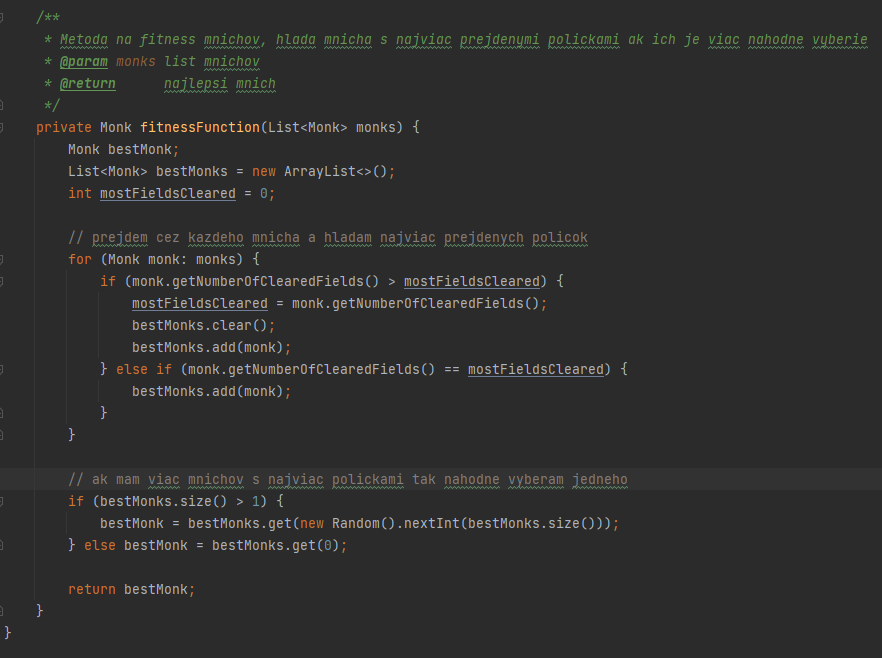

# VAVA-team-project
- tento subor sa bude priebezne menit a rozvijat preto treba davat pozor na jeho zmeny

## Gumkaci v akcii

- spolocny projekt na ktorom sa zucastnili
  - David Kastler (veduci)
  - Peter Koszorus (zastupca veduceho)
  - Mario Kolenic
  - Martin Beňa
  - Adam Koričansky
  - Juraj Glatz

---
# OBSAH
1. [Pravidla clean code ](#-pravidla-clean-code-)
2. [Veci co potrebujeme v projekte](#zoznam-veci-ktore-musime-obsiahnut-v-projekte)

---

# Ako spustit program

- Treba inizializovat backend
  - treba si vytvorit databazu a nastavit ju v `DataLayer/src/main/resources/application.properties`
  - treba si to enviroment variables nastavit prihlasovacie meno a heslo do databazy
  - setup databazy spravime spustenim `DataLayer/src/main/resources/PostgreSQL-database-setup.sql`
  - pre vlozenie mock dat treba spustit `DataLayer/src/main/resources/PostgreSQL-database-mockup.sql`
- Backend spustime pomocou `DataLayer/src/main/java/vava/edo/StartUpBackend.java`
- Frontend spustime pomocou `PresentationLayer/src/main/java/vava/edo/Main.java`

---
# ✅ Pravidla clean code ✅
- chceme mat cisty kod v ktorom sa bude dat lahko pracovat a lahko sa bude dat upravovat
- nechceme aby kazdy pisal kod inak pretoze s toho vznikne gulas a jeden nebude chciet robit v kode toto druheho

### Zaklad pre Javu ☕

| datovy typ           |     styl pisania     |
|:---------------------|:--------------------:|
| funkcie,  metody |     camelCase()      |
| triedy               |      PascalCase      |
| rozhrania            |      PascalCase      |
| priecinky            |      camelCase       |
| namespaces           |      PascalCase      |
| premenne             |      camelCase       |
| konstanty            | SCREAMING_SNAKE_CASE |

### Styl pisania kodu ✍️
- **kod a komentare piseme v anglickom jazyku**
- pre triedy, rozhrania, metody, premenne treba mat **strucny a trefny nazov**  (napr. numberOfClearedFields)
  - ziadne veci ako int X = 5; !
- kazda trieda, rozhranie, metoda (mimo getterov/setterov), zlozitejsi konstruktor **BUDE MAT JAVADOC**
- v kazdej metode v ktorej bude **viac ako 30 riadkov treba okomentovat** fragmenty kodu
- triedu ktora ma **viac ako 300 riadkov treba rozdelit** na viacer tried
- metoda by **nemala mat viack ako 50-60 riadkov** ak ma viac, tak treba ju rozdelit na viacere metody
- je dobre nad kazdy cyklus a podmienku dat **komentar aspon 3-4 slovny** ktory povie cez co iteruje alebo co robi
- pocet vstupnych parametrov do metody bude **max. 5 optimalne 3 vstupne parametre**
  - ak sa inak neda treba vytvorit **triedu s parametrami**
- treba mysliet aj na chybne vstupy, co ak niekde pri vypocte nastala chyba a posielam None alebo podobne?
  - mysliet na toto a davat na to podmienky a ak nastala chyba tak **rozlisitelny print napisat**(ziadne take, že sout(chyba))

### Pracovanie v gite 👨‍💻
- kazdy ma vlastnu vetvu
  - kazdy commit by mal mat nejake zhrnutie co sa v nom pridalo/ zmenilo
  - treba robit co najviac commitov, necommitovat 10 suborov s jednoriadkovim komentarom
    - kludne nech pracujete na viac veciach a ked sa rozhodnete commitnut tak to rozdelte do viac commitov
- **nikdy nedavame nic priamo do master branchu ❗**
- ak mam ready kod ktory chcem dat do mastera
  - zhodnotim ci **ide o komplexnejsiu vec**, kvoli tomu ci na to treba otestovat
    - ide o nieco co sa na inom PC moze spravat inak? (napr. DB)
    - je to nejaka velka zmena kde mohla nastat chyba z nepozornosti
    - otestovat nieco by mal niekto iny (sam si po sebe clovek chybu tazsie vsimne)
  - s veducim sa spravi code review
  - veduci mergne zmeny do mastera
  - skusi sa spustit master ci zmena nevytvorila chybu
  - ostatny si pullnu zmeny

### Organizacia
- pre organizovanie spoluprace budeme pouzivat *github projects*
- na vsetko co robite spravime issue a bude sa dat trackovat progress

### Extrene subory
- tabulky, dokumenty a ostatne veci budeme davat sem, spravime na to subor

### TLDR
- drzim sa Java stylu kodu
- pisat komentare, komentare a komentare
- vsetko ma mat trefny nazov
- dlhe veci rozdelit
- v gite robim len vo svojom branchi
### Priklad takehoto kodu

---
# Zoznam veci ktore musime obsiahnut v projekte
- **Priebezne sem budeme pridavat aj snippety kodu kde boli tieto veci pouzite**

1. Kolekcie (treba vybrať vhodné dátové štruktúry podľa povahy/architektúry projektu)
2. Logovanie (Logovanie biznis logiky aplikácie + Logovanie Exceptions/Errors)
3. Lokalizácia (Preklady a lokalizácia ENG a SK)
4. XML (Použitá 1 vybraná XML technológia, spracovanie/parsovanie XML dokumentov, import/export do XML, SAX, DOM, StAX, JAXB, XStream, Jackson XML, XPATH, XQUERY)
5. Regulárne výrazy (Vyhľadávanie s prepínačmi, filtrovanie)
6. JDBC (Pripojenie na vybranú databázu Derby/MySQL/PostgreSQL/SQLite/Oracle Database, ukladanie dát do DB)
7. Ošetrenie/validácia vstupov + bezpečnosť (Ochrana voči základným SQL injekciám)
8. GUI aplikácia (Swing, JavaFX, Vaadin), nie Android aplikácia
9. Aplikácia by mala byť navrhnutá pre 3 rôznych používateľov/aktérov napr. admin, power/super user, používateľ (user)
10. Dátové zložky musia byť zapúzdrené (všetky private)

## Odovzdavame
1. Zdrojove kody
2. projektovy priecinok
3. Video
4. Dokumentaciu
---
